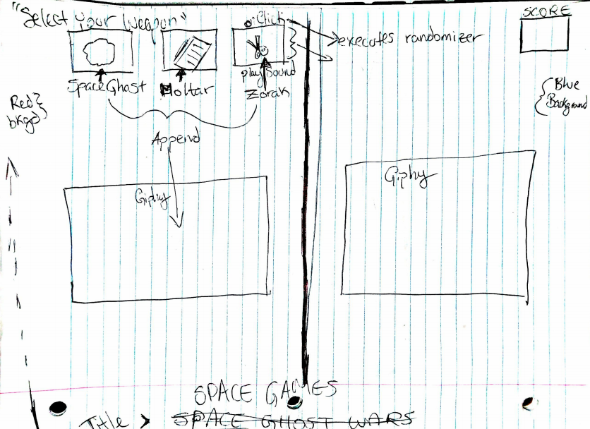

# Space Games
Is a type of rock, paper, scissors game.

 

## What is Space Games?
  This space themed rock, paper, scissors game using comet, nebula, rocket instead.

## Technical Discussion

> Space Games was created using 
* HTML
* CSS
* JavaScript

### Notes on Game Structure

> Code samples, description of challenges you overcame, etc.
A huge challenge for me was figuring out  a bug I created with the Math.random() function and setInterval.  I learned that the setInterval function when set at 100th of a second wrapped set to iterate 3 giphys 25 times = 2.5 seconds and so the winning prompt would have to be set above 2.5 seconds bc it would iterate many wins and many win/lose prompts instead of just 1 win/loss with 1 win / loss prompt. 

> Any credits or notes you feel you should add
 I brain stormed the idea of the game with Mili Neykova which also helped me with Math.Random() function.  Tom Santos helped with a few CSS issues.  Aury Rodriguez helped with my setInterval issue and using innerText when localStorage nor innerHTML were working for my score keeping.
  

## Opportunities for Future Growth

> If you had more time to work on your game, what would you do?
With more time I would add more CSS pizazz , hover effects, animation and sound clips. I would also add a lanndig page and I would change some of my prompts to be modals.  In the future I would also have the score store via localStorage.

References:
setTimeout() - https://www.w3schools.com/jsref/met_win_settimeout.asp 
SetInterval() - 
https://www.w3schools.com/jsref/met_win_setinterval.asp
Math.random() - https://developer.mozilla.org/en-US/docs/Web/JavaScript/Reference/Global_Objects/Math/random 